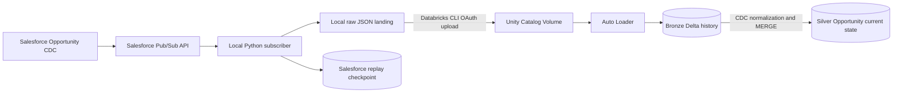

# Salesforce Real-Time Lakehouse

A production-inspired Salesforce Change Data Capture pipeline built with
Python, Salesforce Pub/Sub API, Databricks Auto Loader, Delta Lake, Lakeflow
Jobs, Databricks Asset Bundles, and GitHub Actions.

The project demonstrates how scheduled Salesforce extraction can evolve into a
recoverable near-real-time lakehouse while preserving batch-based bootstrap and
reconciliation as complementary future mechanisms.

## Architecture



Reliability is split across two independent checkpoints:

- the Salesforce replay checkpoint resumes the source subscription;
- the Auto Loader checkpoint tracks files committed to Bronze.

The main Lakeflow Job enforces:

```text
Bronze ingestion -> successful completion -> Silver current-state merge
```

## Implemented Capabilities

### Salesforce Source

- [x] OAuth Client Credentials authentication
- [x] REST API and SOQL validation
- [x] Opportunity Change Data Capture
- [x] Official Pub/Sub API protobuf and generated Python gRPC stubs
- [x] TLS Pub/Sub connection and topic/schema discovery
- [x] Avro payload decoding and `changedFields` bitmap expansion
- [x] CREATE, UPDATE, and DELETE event receipt

### Durable Local Ingestion

- [x] Partitioned raw JSON landing under `raw_events/opportunity/YYYY/MM/DD/`
- [x] Atomic event writes with deterministic replay-based filenames
- [x] Base64 replay ID serialization
- [x] Atomic replay checkpoint persistence
- [x] Subscriber recovery with `ReplayPreset.CUSTOM`
- [x] Duplicate landing protection

### Databricks Lakehouse

- [x] Dedicated Unity Catalog catalog, schemas, and managed Volumes
- [x] OAuth-authenticated local upload to the Databricks Volume
- [x] Explicit Bronze schema with raw payload stored as `VARIANT`
- [x] Auto Loader ingestion with independent schema/checkpoint state
- [x] Idempotent Bronze reruns
- [x] Opportunity Silver current-state Delta table
- [x] Field-level partial UPDATE semantics
- [x] Ordering by commit timestamp, commit number, and sequence number
- [x] Soft DELETE with last-known business values preserved
- [x] Idempotent Delta MERGE reruns

### Delivery And Operations

- [x] DAB-managed standalone Bronze and Silver Jobs
- [x] DAB-managed Bronze-to-Silver Lakeflow orchestration
- [x] Logical DEV and PROD-SIMULATED targets
- [x] Pull request CI with deterministic Python tests and target validation
- [x] Automatic DEV deployment from `dev`
- [x] Automatic PROD-SIMULATED deployment from `main`

## Repository Structure

```text
.
|-- .github/workflows/          # CI, DEV deploy, PROD-SIMULATED deploy
|-- docs/                       # Architecture, operations, and study guides
|-- generated/                  # Generated Salesforce protobuf/gRPC modules
|-- proto/                      # Official Salesforce Pub/Sub API contract
|-- resources/                  # Databricks Asset Bundle Job resources
|-- src/
|   |-- databricks/             # Bronze and Silver Spark workloads
|   `-- salesforce_cdc/         # Auth, Pub/Sub, landing, replay, upload
|-- tests/                      # Deterministic unit tests
|-- databricks.yml              # Bundle variables and environment targets
|-- requirements.txt            # Runtime dependencies
`-- requirements-dev.txt        # Test dependencies
```

## Data Layers

### Local Raw Event

Each persisted JSON event contains:

```text
replay_id, schema_id, record_ids, change_type, changed_fields,
commit_timestamp, received_at, topic, payload
```

The full decoded CDC payload is preserved. Binary values use reversible Base64
encoding. Credentials and Pub/Sub authentication metadata are never persisted.

### Bronze

```text
salesforce_realtime_lakehouse.bronze.opportunity_cdc
```

Bronze preserves the CDC envelope and raw payload, adding `_source_file`,
`_ingested_at`, and `_rescued_data`. The payload uses Databricks `VARIANT` to
tolerate additive Salesforce schema changes without aggressively flattening
source history.

### Silver

```text
salesforce_realtime_lakehouse.silver.opportunity
```

Silver stores one current known row per Opportunity. UPDATE events change only
fields named in `changed_fields`; omitted fields retain their prior values.
DELETE is modeled as a soft delete using `is_deleted` and `deleted_at`.

Because the project began from CDC rather than a full initial snapshot, fields
never observed in CREATE or UPDATE history can remain null. Snapshot bootstrap
and reconciliation are intentionally deferred.

## Prerequisites

- Python 3.12 or newer
- a Salesforce org with Opportunity CDC enabled
- a Salesforce integration application using OAuth Client Credentials
- Databricks CLI authenticated locally with OAuth
- Databricks Free Edition or another Unity Catalog-enabled workspace
- access to create schemas, managed Volumes, Jobs, and Delta tables

Create a local virtual environment and install dependencies:

```bash
python3 -m venv .venv
./.venv/bin/python -m pip install --requirement requirements-dev.txt
```

Copy `.env.example` to `.env` and populate it locally. Never commit `.env` or
paste its contents into logs, issues, screenshots, or chat.

## Local Salesforce CDC

Validate authentication, REST, and Pub/Sub access:

```bash
./.venv/bin/python -m src.salesforce_cdc.auth
./.venv/bin/python -m src.salesforce_cdc.rest_client
./.venv/bin/python -m src.salesforce_cdc.pubsub_client
```

Start the durable subscriber:

```bash
./.venv/bin/python -u -m src.salesforce_cdc.subscriber
```

Change an Opportunity in Salesforce. The subscriber decodes the CDC event,
writes the raw JSON atomically, and advances the replay checkpoint only after
the event is durable.

## Databricks Workflow

Upload local event files while preserving date partitions:

```bash
./.venv/bin/python -m src.salesforce_cdc.databricks_upload
```

Validate, deploy, and run the development workflow:

```bash
databricks bundle validate --target dev
databricks bundle deploy --target dev
databricks bundle run --target dev salesforce_cdc_pipeline
```

Standalone Jobs remain available for focused debugging:

```bash
databricks bundle run --target dev bronze_ingestion
databricks bundle run --target dev silver_opportunity
```

Validate the resulting tables:

```sql
SELECT COUNT(*)
FROM salesforce_realtime_lakehouse.bronze.opportunity_cdc;

SELECT
	opportunity_id,
	name,
	stage_name,
	amount,
	close_date,
	is_deleted,
	last_change_type,
	last_commit_timestamp,
	updated_at
FROM salesforce_realtime_lakehouse.silver.opportunity
ORDER BY updated_at DESC;
```

## Databricks Environments

DEV and PROD-SIMULATED share one physical Databricks Free Edition workspace but
use separate logical namespaces and DAB state:

| Setting | DEV | PROD-SIMULATED |
|---|---|---|
| DAB target | `dev` | `prod` |
| deployment mode | `development` | `production` |
| Bronze schema | `bronze` | `bronze_prod` |
| Silver schema | `silver` | `silver_prod` |
| landing Volume | `salesforce_cdc_landing` | `salesforce_cdc_landing_prod` |
| Job prefix | `[dev <user>]` | `[PROD-SIMULATED]` |
| bundle state | user-scoped DEV path | dedicated production path |

This is logical isolation for CI/CD learning, not a true production security
boundary. Real production would normally use separate workspaces/accounts,
service principals, storage controls, networking, quotas, and audit policies.

## CI/CD

```text
feature/* -> PR to dev -> CI -> merge -> automatic DEV deployment
dev       -> PR to main -> CI -> merge -> PROD-SIMULATED deployment
```

Pull request CI runs deterministic tests and validates the matching DAB target.
CI never deploys or runs Salesforce integration tests. Deployment workflows
validate and deploy bundle resources but do not execute the data pipeline.

The current Free Edition account cannot configure the account-level federation
policy required for GitHub OIDC. GitHub Actions therefore uses a short-lived PAT
stored only in encrypted GitHub repository/environment secrets as a lab
fallback. OIDC with a dedicated service principal remains the preferred model
for a full Databricks account.

See [GitHub Actions CI/CD](docs/14-github-actions-cicd.md) for branch rules,
GitHub Environments, authentication setup, and promotion tests.

## Testing

Run the deterministic local suite without Salesforce or Databricks runtime:

```bash
./.venv/bin/python -m pytest --quiet
```

Validate both bundle targets:

```bash
databricks bundle validate --target dev
databricks bundle validate --target prod
```

The suite covers replay encoding, atomic checkpoints, deterministic event
paths, duplicate landing, replay request selection, upload path mapping, Bronze
schema helpers, Silver MERGE semantics, and credential-free imports.

## Security

- `.env`, `.databrickscfg`, `raw_events/`, `checkpoints/`, and `logs/` are
	ignored and absent from Git history.
- Salesforce and Databricks credentials are supplied only at runtime.
- GitHub Actions uses encrypted secrets; no token is present in workflow YAML.
- TLS certificate verification remains enabled.
- Event payloads and replay IDs are not printed by Databricks validation jobs.
- The workspace host in `databricks.yml` is configuration, not a credential.

## Known Limitations And Next Steps

- Local raw landing is not resilient to machine loss.
- One JSON file per event creates small-file overhead at scale.
- The uploader is manually invoked and reuploads deterministic paths.
- Silver currently scans available Bronze history before applying an idempotent
	MERGE; incremental Silver progress is a future optimization.
- CDC-only bootstrap can leave never-observed Opportunity fields null.
- PROD-SIMULATED is logical isolation inside one Free Edition workspace.
- PAT authentication is a temporary CI/CD lab fallback.
- Initial snapshot, reconciliation, Gold, dbt, monitoring, and cost controls are
	future phases.

## Documentation

The [study guide](docs/README.md) contains detailed implementation notes,
validation runbooks, architecture trade-offs, security guidance, and CI/CD
setup instructions.