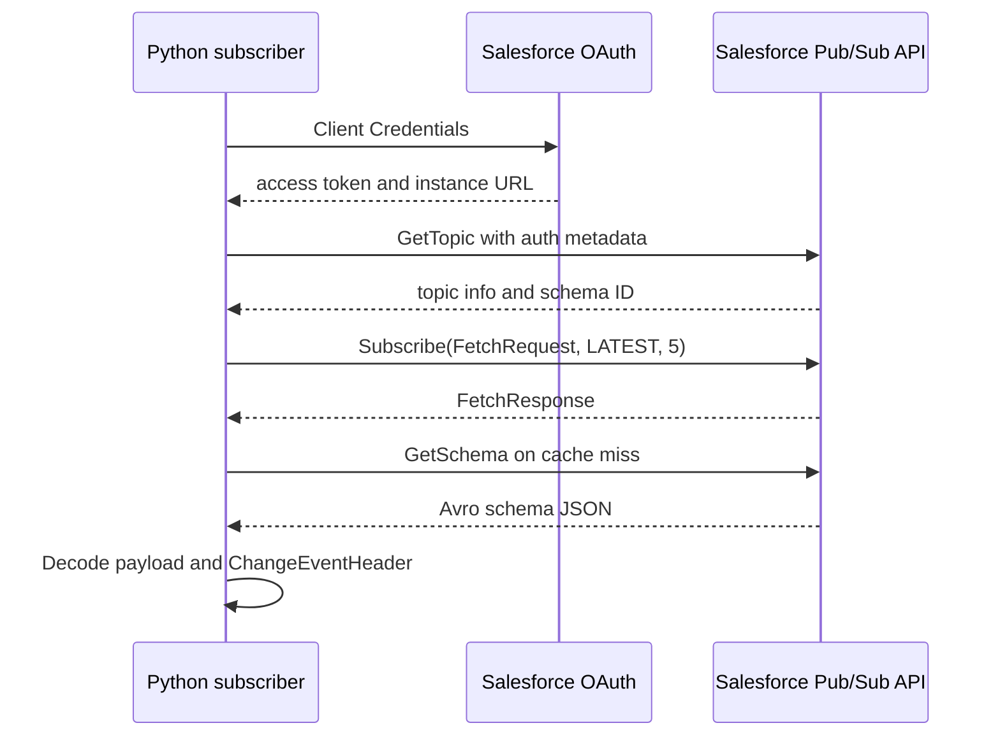

# 04 - CDC Subscriber and Avro

## End-to-End Flow

`src/salesforce_cdc/subscriber.py` follows this sequence:



## Subscription and Flow Control

`Subscribe` is bidirectional. The client sends `FetchRequest` messages that
declare capacity, and the server delivers up to the requested event count. The
local test asks for five events starting at `LATEST`.

`LATEST` means that the subscriber observes events created after the stream
starts. This prevents an old event from being mistaken for the new test change.

A queue keeps the request side of the stream open. On shutdown, the subscriber
adds a sentinel to the queue and cancels the response stream.

## Received Structure

Each `ConsumerEvent` includes:

- `event.schema_id`;
- `event.payload`, containing Avro bytes;
- `replay_id`, an opaque event bus position.

A `FetchResponse` can also include multiple events, `latest_replay_id`,
`pending_num_requested`, and an `rpc_id` for support diagnostics.

Replay IDs must remain opaque bytes. Applications should not derive numeric or
ordering meaning from their internal representation.

## Avro Decoding

The subscriber fetches schema JSON only for an unseen schema ID. It then:

1. parses JSON into an `avro.schema.Schema`;
2. creates a `BinaryDecoder` over the payload bytes;
3. reads the payload with `DatumReader` and the writer schema;
4. accesses only `ChangeEventHeader` for safe console output.

The complete business payload is not printed, reducing the risk of exposing
PII, free text, or commercial values.

## changedFields Bitmap

Pub/Sub API can represent `changedFields` as a compact bitmap:

```text
["0x02"]
```

Each set bit maps to a field position in the Avro schema. The implementation:

1. removes the `0x` prefix;
2. converts hexadecimal to a zero-padded bit string;
3. reverses bit order according to Salesforce encoding;
4. maps set indexes to `schema.fields[index].name`;
5. supports compound fields in `<parent-position>-<child-bitmap>` form.

The real StageName test also reported Salesforce-managed fields changed in the
same commit. This confirms that bitmap expansion returns all changed fields,
not only the field manually edited by the user.

## Safe Event Output

```text
CDC event received
Record IDs: <record-id>
Change type: UPDATE
Changed fields: StageName, <system-fields>
Commit timestamp: <UTC-timestamp>
Schema ID: <schema-id>
```

Documentation deliberately uses placeholders. Do not publish real record IDs,
payloads, replay IDs, or organization identifiers.

## Known Limitations

- replay IDs are not persisted;
- idempotent delivery is not implemented;
- token renewal and reconnect are not implemented;
- there is no quarantine path for invalid payloads;
- events are not written to a landing zone or Databricks.

For production, capacity should advance only after the previous event is
durably written. Replay state should advance after the durable write. This
creates at-least-once delivery, so downstream deduplication remains mandatory.

## Official References

- [Subscribe RPC](https://developer.salesforce.com/docs/platform/pub-sub-api/guide/subscribe-rpc.html)
- [Event deserialization](https://developer.salesforce.com/docs/platform/pub-sub-api/guide/event-deserialization-considerations.html)
- [Apache Avro specification](https://avro.apache.org/docs/current/specification/)