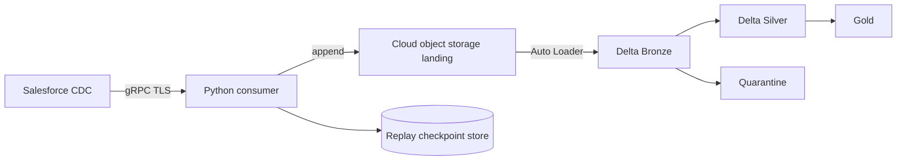

# 06 - Future Databricks Production Architecture

## Core Principle

The gRPC subscriber and lakehouse processing have different lifecycles. The
subscriber maintains a long-lived Salesforce connection. The lakehouse should
process durable, replayable data. A landing zone decouples them.



Advance the Salesforce replay checkpoint only after the event is durable in
landing. A crash before checkpointing can cause a duplicate instead of data
loss. Downstream processing must therefore be idempotent.

## Where to Run the Consumer

### Option A - Decoupled Service, Recommended

Run the Python client in a container runtime or Kubernetes:

- Azure Container Apps, AWS ECS/Fargate, a suitable Cloud Run service, or
  Kubernetes;
- workload identity for secret access and object storage writes;
- automatic restart, health checks, and metrics;
- compute sized independently from Spark workloads.

This lifecycle fits a long-running gRPC connection, isolates ingestion from
Databricks maintenance, and allows the lakehouse to replay durable files
without reconnecting to Salesforce.

### Option B - Continuous Databricks Job, Useful for Learning

A Python task can run the subscriber in a continuously restarted Job and write
to a Unity Catalog Volume or external location.

Important limitations:

- the subscriber runs on the driver; it is not a native Spark streaming source;
- Spark autoscaling does not distribute a single gRPC stream;
- cluster restarts make durable replay state mandatory;
- keeping Spark compute alive for one connection can be expensive;
- direct row-by-row Delta writes create overhead and contention.

Use small isolated compute for a lab. Compare cost and resilience with a
decoupled service before selecting this model for production.

### Option C - Message Broker

At larger scale, the consumer can publish to Kafka, Event Hubs, or Kinesis.
This adds buffering, fan-out, and retention, but also cost and another delivery
contract. Do not add a broker unless throughput, consumers, or recovery needs
justify it. Object storage is often enough for a seconds-to-minutes SLA.

## Landing Contract

Landing should be append-only. A possible envelope is:

```json
{
  "source": "salesforce",
  "org_key": "<logical-org-name>",
  "topic": "/data/OpportunityChangeEvent",
  "schema_id": "<schema-id>",
  "replay_id_base64": "<opaque-value>",
  "event_id": "<event-id>",
  "received_at_utc": "<timestamp>",
  "payload_base64": "<raw-avro-bytes>"
}
```

Never include access tokens, client secrets, gRPC headers, or login URLs.

Raw Avro bytes plus schema ID provide the strongest reprocessing capability.
Decoded JSON is simpler for a lab but loses some type fidelity and depends on
the decoder version used at ingestion time.

### File Layout

```text
landing/salesforce/opportunity_change_event/
  received_date=YYYY-MM-DD/
  received_hour=HH/
  part-<uuid>.json
```

Avoid one file per event. Buffer a bounded batch by size or time, finalize the
file atomically, and then update the replay checkpoint. Measure the target file
size; excessive small files degrade discovery and processing.

## Lakehouse Layers

### Landing

- immutable event envelopes;
- sufficient operational replay retention;
- encryption and restricted access;
- no business transformations.

### Bronze

- incremental landing ingestion through Auto Loader;
- one row per event;
- raw payload, schema ID, replay ID, and timestamps preserved;
- technical columns for ingestion time, source path, and decode status;
- invalid records routed to quarantine instead of dropped.

### Silver

- deterministic Avro decoding;
- normalized `ChangeEventHeader`;
- deduplication and logical ordering;
- `CREATE`, `UPDATE`, `DELETE`, and `UNDELETE` application;
- current Opportunity state and optional full history.

### Gold

- consumption-oriented models;
- business and pipeline metrics;
- documented SLAs and rules;
- no direct dependency on gRPC payload structure.

## Auto Loader

Auto Loader should observe finalized landing files. Use a dedicated checkpoint
and schema location for each environment and stream, explicit schema evolution,
rescued data for unexpected fields, and a trigger aligned with the SLA.

The Salesforce replay checkpoint and Auto Loader checkpoint are separate. The
first tracks source progress; the second tracks file discovery and processing.
Neither can replace the other.

## State, Ordering, and Idempotency

Persist per Salesforce organization and topic:

- last replay ID durably landed;
- time of the last received event;
- last token renewal;
- consumer version;
- subscription health state.

Organization, topic, and opaque replay ID can form a transport deduplication
key. Applying business changes should also consider `commitNumber`,
`transactionKey`, and `sequenceNumber`. Do not order solely by `received_at`;
network retries can change arrival order.

## Phased Production Simulation

### Phase 1 - Complete

- authenticate locally;
- validate REST, topic, and schema;
- receive and decode an Opportunity CDC event.

### Phase 2 - Local Landing

- write envelopes to a Git-ignored directory;
- use atomic file finalization;
- persist replay only after the file is durable;
- test restarts and duplicates.

### Phase 3 - Development Cloud Landing

- create a dev-only bucket or container;
- use workload identity instead of storage keys;
- configure encryption, retention, and lifecycle;
- run the consumer in a container or small Job.

### Phase 4 - Bronze with Auto Loader

- provision an external location and Volume;
- configure independent checkpoint and schema paths;
- preserve raw payload and technical metadata;
- measure end-to-end lag.

### Phase 5 - Silver and Reconciliation

- decode Avro deterministically;
- deduplicate and apply all change types;
- implement the initial snapshot;
- reconcile by `SystemModstamp`.

### Phase 6 - Failure Exercises

- stop the consumer during a landing write;
- expire or revoke its token;
- interrupt DNS or network access;
- replay the same event;
- introduce a new schema ID;
- create a backlog larger than processing capacity;
- simulate an expired replay window and trigger backfill.

## Production-Inspired Exit Criteria

- no human credentials;
- no secrets in code, Git, logs, or cluster configuration;
- durable landing before replay advancement;
- idempotent processing;
- tested reconnect and token refresh;
- observable lag and failures;
- scheduled reconciliation;
- tested recovery runbook;
- isolated dev, staging, and production environments;
- reviewable infrastructure and permissions as code.

## Official References

- [Databricks Auto Loader](https://docs.databricks.com/aws/en/ingestion/cloud-object-storage/auto-loader/)
- [Structured Streaming](https://docs.databricks.com/aws/en/structured-streaming/)
- [Unity Catalog external locations](https://docs.databricks.com/aws/en/connect/unity-catalog/cloud-storage/external-locations)
- [Databricks service principals](https://docs.databricks.com/aws/en/admin/users-groups/service-principals)