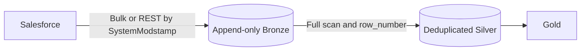
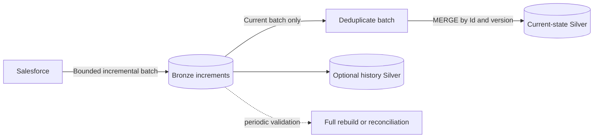
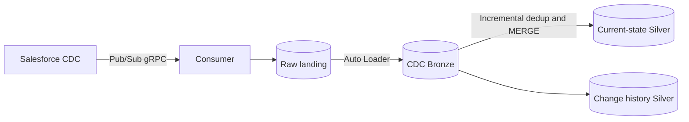
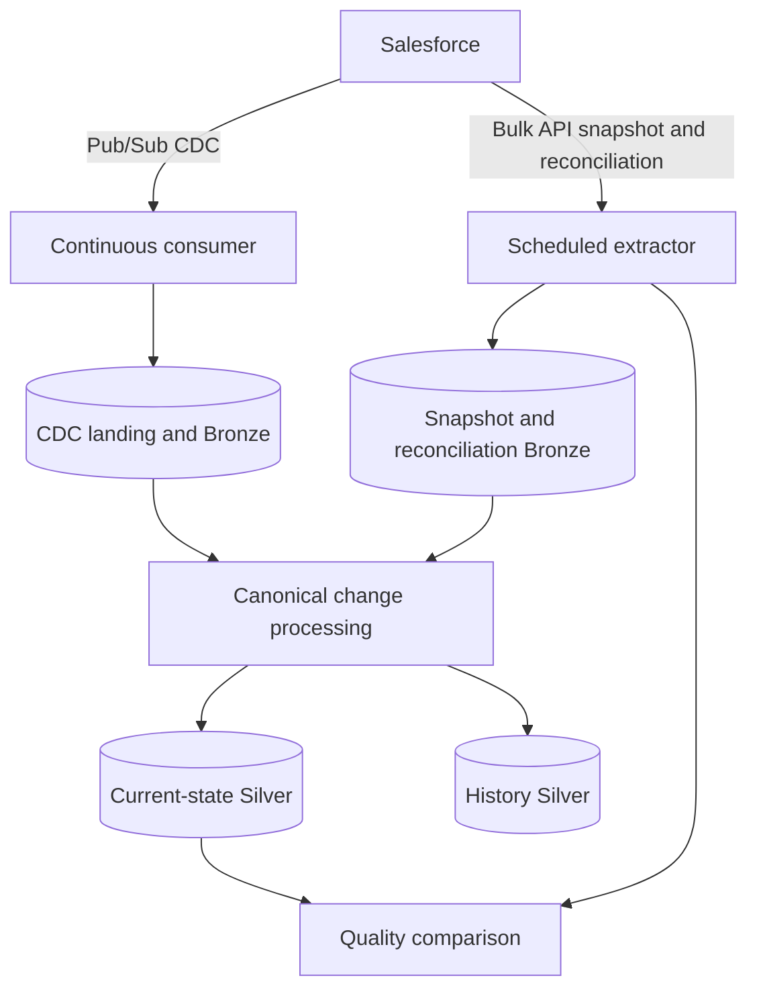

# 09 - Architecture Trade-Offs

## Scope

This chapter compares three complete lakehouse designs rather than only their
Salesforce extraction mechanisms:

1. scheduled incremental extraction followed by a full Bronze scan to rebuild
   deduplicated Silver;
2. Pub/Sub CDC followed by incremental Silver updates;
3. a hybrid model that combines CDC latency with batch recovery and
   reconciliation.

The goal is not to declare one design universally superior. The right choice
depends on data volume, freshness SLA, failure tolerance, engineering capacity,
and audit requirements.

## Architecture A - Incremental Batch and Full Bronze Scan



### Typical Flow

1. every few hours, select Salesforce records within a `SystemModstamp` window;
2. append the extracted records to Bronze with batch metadata;
3. scan all historical Bronze rows;
4. partition by Salesforce record ID;
5. order by source version and ingestion metadata;
6. keep the latest row per ID;
7. overwrite or replace the deduplicated Silver table.

A simplified Silver query looks like:

```sql
WITH ranked AS (
  SELECT
    *,
    ROW_NUMBER() OVER (
      PARTITION BY Id
      ORDER BY SystemModstamp DESC, _ingested_at DESC
    ) AS row_number
  FROM bronze.salesforce_opportunity
)
SELECT * EXCEPT (row_number)
FROM ranked
WHERE row_number = 1;
```

Production logic must also define delete handling, deterministic tie-breakers,
schema evolution, and whether historical versions remain queryable.

### Strengths

- simple mental model;
- Bronze is an auditable append-only history;
- Silver can be rebuilt entirely from Bronze;
- no long-running subscriber to operate;
- failures are retried by rerunning a bounded batch;
- well suited to small tables and relaxed freshness SLAs.

### Weaknesses

- Silver compute grows with total Bronze history rather than new data volume;
- repeated window sorts and shuffles become expensive;
- overwrite increases runtime, file churn, and concurrent-reader risk;
- freshness cannot be better than the extraction and transformation schedule;
- intermediate updates between polls can disappear;
- ordinary incremental SOQL does not provide complete hard-delete semantics;
- late batches and tied timestamps require careful ordering.

### Cost Shape

If Bronze contains $N$ historical rows and each run adds $\Delta N$, a full
rebuild repeatedly processes approximately $N$, even when $\Delta N \ll N$.
As history grows, the transformation can dominate extraction cost.

This design remains reasonable when:

- $N$ is small;
- the table is rebuilt infrequently;
- compute cost is not material;
- correctness through simple replay matters more than latency;
- the team prefers a low-operational-complexity first version.

## Improving the Batch-Only Design

Batch extraction does not require a full Bronze scan on every run. A stronger
batch-only architecture separates incremental maintenance from periodic rebuild.



### Incremental Silver Pattern

1. assign a unique `_batch_id` and fixed source window to each extraction;
2. append the batch to Bronze;
3. deduplicate only that batch by `Id` and source version;
4. `MERGE` into current-state Silver;
5. update the source watermark only after Bronze and Silver succeed;
6. periodically rebuild or reconcile to detect accumulated drift.

Conceptual merge:

```sql
MERGE INTO silver.opportunity AS target
USING current_batch AS source
ON target.Id = source.Id
WHEN MATCHED
  AND source.SystemModstamp >= target.SystemModstamp
  THEN UPDATE SET *
WHEN NOT MATCHED
  THEN INSERT *;
```

The real implementation should use explicit columns, deterministic equality
rules, and delete handling instead of `SET *`.

### Trade-Off

Incremental `MERGE` reduces steady-state compute from cumulative history to the
new batch and touched Silver files. In exchange, the pipeline now maintains
state and requires idempotent batch identifiers, watermark transactions, and a
periodic correctness check.

This is often the best intermediate step before CDC because it improves cost
without introducing a long-running subscriber.

## Architecture B - CDC and Incremental Silver



### Typical Flow

1. subscribe from the last durable replay ID;
2. land raw event envelopes before advancing replay state;
3. ingest finalized files incrementally into Bronze;
4. decode Avro and normalize `ChangeEventHeader`;
5. deduplicate transport retries;
6. order changes by Salesforce commit metadata;
7. apply only new changes to current-state Silver;
8. retain an immutable event history when required.

### Strengths

- seconds-level latency;
- work is proportional to changed records;
- explicit create, update, delete, and undelete semantics;
- changed-field and transaction context;
- no repeated source polling when nothing changed;
- natural immutable change log.

### Weaknesses

- subscriber, token renewal, reconnect, and replay state require operations;
- at-least-once delivery requires deduplication;
- finite replay retention creates a recovery deadline;
- schema evolution affects Avro decoding;
- a bug in event application can accumulate state drift;
- an initial snapshot is still required.

### Silver Semantics

CDC Silver should not compare only `commitTimestamp`. Multiple events can share
a timestamp, and network arrival order is not source order. Use record ID,
change type, `commitNumber`, `transactionKey`, `sequenceNumber`, and a transport
deduplication key based on organization, topic, and replay ID.

`DELETE` should remove or tombstone the current-state row while remaining in the
history table. `UNDELETE` and gap recovery must have explicit rules.

## Architecture C - Hybrid



### Responsibility Split

| Concern | Primary mechanism |
|---|---|
| Initial historical load | Bulk API 2.0 snapshot |
| Low-latency changes | Pub/Sub CDC |
| Long outage recovery | Bulk API 2.0 backfill |
| Completeness validation | `SystemModstamp` reconciliation |
| Point diagnostics | REST API |
| Current-state maintenance | incremental Silver `MERGE` |
| Deterministic rebuild | Bronze history plus snapshots |

### Why Hybrid Is Usually Strongest

CDC is optimized for change propagation, not infinite historical retention.
Batch is optimized for bounded sets, not seconds-level freshness. Combining
them removes the need to force either mechanism into the other's role.

The trade-off is additional control-plane complexity: snapshot cutoffs, CDC
buffering, source precedence, deduplication across paths, and reconciliation
workflows must be explicit.

## Hybrid Bootstrap

Two safe approaches are common.

### CDC-First Buffering

1. start CDC and durably buffer events;
2. capture the effective cutover metadata;
3. run the initial Bulk API snapshot;
4. load the snapshot into Silver;
5. apply buffered CDC events after the snapshot cutoff;
6. continue streaming.

This minimizes the risk of missing changes during a long snapshot, but requires
careful cutoff and ordering logic.

### Overlapping Window

1. run a snapshot with a known extraction window;
2. start CDC with deliberate temporal overlap where replay allows;
3. ingest both paths;
4. deduplicate and select the newest valid source version;
5. validate counts and sample hashes before cutover.

Overlap intentionally prefers duplicates over gaps.

## Bronze and Silver Layout Options

### Separate Bronze Tables

Use one table for batch snapshots or increments and another for CDC events.

Advantages:

- preserves each source contract;
- simplifies raw auditing and troubleshooting;
- avoids forcing snapshot rows into an event schema.

Disadvantages:

- Silver must normalize and reconcile two inputs;
- cross-path deduplication is more complex.

### Canonical Bronze Envelope

Normalize both paths into a shared change envelope with source type, record ID,
source version, operation, extraction window, and raw payload reference.

Advantages:

- one downstream contract;
- shared deduplication and quality logic.

Disadvantages:

- normalization becomes a critical component;
- a snapshot row does not naturally have CDC transaction metadata;
- raw source fidelity must still be preserved separately.

For this project, separate raw Bronze tables plus a canonical normalized Silver
change stream offer the clearest audit path.

## Full Rebuild Versus Incremental MERGE

| Dimension | Full Bronze scan | Incremental Silver MERGE |
|---|---|---|
| Compute basis | all historical rows | new or affected rows |
| Recovery model | rebuild everything | replay batches or events |
| State complexity | low | medium to high |
| Runtime growth | grows with history | grows with change volume |
| Easy correctness audit | strong | requires reconciliation |
| Near-real-time fit | poor | strong |
| Concurrent updates | overwrite coordination | merge conflict coordination |

A mature design commonly uses both: incremental `MERGE` for routine operation
and a tested full rebuild path for disaster recovery and semantic validation.

## Failure Scenarios

| Failure | Batch full-scan response | CDC response | Hybrid response |
|---|---|---|---|
| Extractor down for one cycle | rerun window | replay from checkpoint | replay CDC; batch reconciles |
| Outage beyond replay retention | unaffected next batch | gap requires backfill | Bulk backfill closes gap |
| Duplicate delivery | batch ID dedup | replay ID dedup | dedup within and across paths |
| Wrong Silver logic | full rebuild | replay retained Bronze | rebuild from snapshot plus CDC |
| Source schema change | batch schema handling | new Avro schema ID | normalize both paths |
| Hard delete | dedicated deleted query | explicit CDC delete | CDC plus reconciliation |
| Watermark corruption | rerun overlap | restore replay state | restore and reconcile |

## Operational Metrics

Compare architectures with measured values:

- source-to-Silver latency percentiles;
- Salesforce API consumption;
- Bronze rows scanned per new source row;
- Silver bytes rewritten per changed row;
- duplicate and out-of-order rates;
- replay lag and oldest recoverable position;
- reconciliation mismatch count;
- full rebuild duration;
- cost per million source changes;
- recovery point and recovery time objectives.

Without these metrics, architecture discussions remain preference rather than
engineering evidence.

## Decision Guide

Choose scheduled incremental batch with full Silver rebuild when data is small,
latency is relaxed, and operational simplicity is the dominant requirement.

Choose batch extraction with incremental Silver `MERGE` when the current source
polling is acceptable but cumulative Bronze scans have become expensive.

Choose CDC when seconds-level freshness and complete change semantics justify a
long-running service and replay operations.

Choose hybrid for important datasets that require both low latency and a
bounded, independent way to prove completeness and recover from long gaps.

## Recommended Evolution for This Repository

1. keep the current local CDC subscriber as the event-source foundation;
2. document the existing batch watermark and Silver rebuild behavior with
   measured volumes and runtimes;
3. add durable CDC landing and replay checkpoints;
4. implement CDC Bronze without replacing the batch pipeline;
5. build an incremental Silver `MERGE` and run it in shadow mode;
6. compare shadow Silver with the established batch Silver;
7. add scheduled `SystemModstamp` reconciliation;
8. test snapshot plus CDC recovery from an empty Silver table;
9. reduce full rebuild frequency only after correctness and cost are proven;
10. retain a full rebuild runbook even after CDC becomes primary.

This sequence turns the existing batch implementation into a correctness oracle
during migration instead of discarding it prematurely.