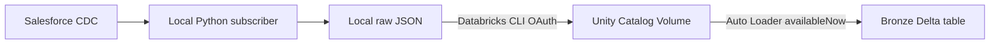

# 11 - Databricks Bronze Ingestion

## Architecture



The implementation uses a DAB-managed Lakeflow Job with a serverless Python
task. A Job was selected over a Declarative Pipeline for this first Bronze
because the checkpoint, explicit schema, and one-shot `availableNow` behavior
remain visible and easy to study.

## Dedicated Unity Catalog Namespace

Development uses:

```text
Catalog: salesforce_realtime_lakehouse
Schema:  bronze
Volume:  salesforce_cdc_landing
Table:   opportunity_cdc
```

The names are DAB variable defaults and can be overridden. No credentials or
tokens are stored in bundle configuration.

### One-Time Free Edition Setup

The Free Edition workspace supports Unity Catalog Volumes but its Catalogs REST
API cannot create a new managed catalog without an explicit storage root. The
SQL Warehouse can create one using the workspace's Default Storage.

Create the catalog through the Databricks SQL editor:

```sql
CREATE CATALOG IF NOT EXISTS salesforce_realtime_lakehouse
COMMENT 'Salesforce real-time lakehouse project';
```

Then create the schema and managed Volume through the CLI:

```bash
databricks schemas create bronze salesforce_realtime_lakehouse \
  --comment "Bronze ingestion layer"

databricks volumes create \
  salesforce_realtime_lakehouse \
  bronze \
  salesforce_cdc_landing \
  MANAGED \
  --comment "Salesforce CDC landing and Auto Loader state"
```

These resources were created and validated in the development workspace.

## Bundle Structure

```text
databricks.yml
resources/
  bronze_job.yml
src/
  databricks/
    bronze_ingestion.py
```

`databricks.yml` keeps the existing workspace host and defines configurable
catalog, schema, Volume, and table variables. It includes YAML resources from
`resources/*.yml`.

`resources/bronze_job.yml` defines one serverless `spark_python_task`. It uses
serverless environment version 4, retries transient failures, and prevents
concurrent runs.

## Local Upload

Run:

```bash
./.venv/bin/python -m src.salesforce_cdc.databricks_upload
```

The utility enumerates only `event-*.json` under the local Opportunity landing,
creates required Volume directories, and preserves the `YYYY/MM/DD` structure:

```text
/Volumes/salesforce_realtime_lakehouse/bronze/salesforce_cdc_landing/
  salesforce/opportunity/YYYY/MM/DD/event-<hash>.json
```

Authentication is delegated to the installed Databricks CLI and its OAuth
profile. The utility does not read `.env`, checkpoints, access tokens, or
`.databrickscfg`. Uploading the same deterministic filename again replaces the
same landing object; it does not create random duplicates.

## Bronze Schema

Auto Loader uses an explicit top-level schema:

| Column | Type |
|---|---|
| `replay_id` | `STRING` |
| `schema_id` | `STRING` |
| `record_ids` | `ARRAY<STRING>` |
| `change_type` | `STRING` |
| `changed_fields` | `ARRAY<STRING>` |
| `commit_timestamp` | `TIMESTAMP` |
| `received_at` | `TIMESTAMP` |
| `topic` | `STRING` |
| `payload` | `VARIANT` |
| `_rescued_data` | `STRING` |
| `_source_file` | `STRING` |
| `_ingested_at` | `TIMESTAMP` |

`VARIANT` preserves the full decoded Salesforce payload and tolerates additive
or shape changes inside it. Frequently queried envelope fields stay strongly
typed. `_rescued_data` captures top-level fields or values that do not match
the expected schema instead of silently dropping them.

The source path uses Unity Catalog's supported `_metadata.file_path` field.

## Auto Loader State

Both schema and checkpoint state are isolated inside the Volume:

```text
_state/opportunity_bronze_schema/
_state/opportunity_bronze_checkpoint/
```

The Salesforce replay checkpoint and Auto Loader checkpoint solve different
problems:

- Salesforce replay tracks source event recovery;
- Auto Loader checkpoint tracks discovered and committed files.

The Job uses `availableNow=True`, processes all currently unhandled files, and
terminates. Rerunning without new files does not append duplicate Bronze rows.

## Deploy and Run

```bash
databricks bundle validate -t dev
databricks bundle deploy -t dev
databricks bundle run -t dev bronze_ingestion
```

Validation and deployment completed successfully in the Free Edition workspace.
The first run ingested three local CDC events. A second run without new files
left the row count unchanged, validating Auto Loader checkpoint idempotency.

## SQL Validation

```sql
SELECT
  COUNT(*) AS row_count,
  COUNT(replay_id) AS replay_id_count,
  COUNT(change_type) AS change_type_count,
  COUNT(payload) AS payload_count,
  COUNT(_source_file) AS source_file_count,
  COUNT(_ingested_at) AS ingested_at_count
FROM salesforce_realtime_lakehouse.bronze.opportunity_cdc;
```

Inspect the schema without returning business payloads:

```sql
DESCRIBE TABLE salesforce_realtime_lakehouse.bronze.opportunity_cdc;
```

For controlled development inspection:

```sql
SELECT
  change_type,
  commit_timestamp,
  topic,
  _source_file,
  _ingested_at
FROM salesforce_realtime_lakehouse.bronze.opportunity_cdc
ORDER BY commit_timestamp DESC
LIMIT 20;
```

## Known Limitations

- local-to-Volume upload is manual;
- upload uses the current developer's OAuth profile;
- one file per CDC event produces small files;
- the catalog requires one-time SQL creation in Free Edition;
- no schedule is configured for the Job;
- no business deduplication or current-state logic exists;
- Silver, dbt, reconciliation, and CI/CD are intentionally out of scope.

## Next CI Phase

A future GitHub Actions pull-request workflow should run Python unit tests,
Python syntax and lint checks, secret scanning, and `databricks bundle validate`
using short-lived workload identity where supported. Deployment should remain a
separate protected workflow. No GitHub Actions files are included in this phase.